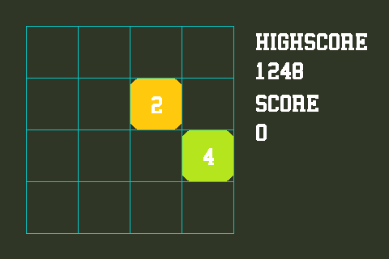
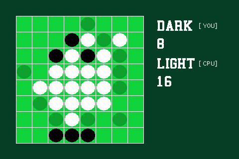
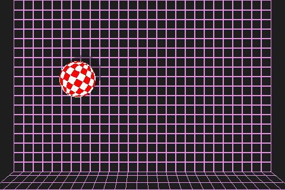
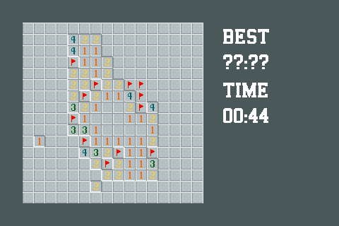
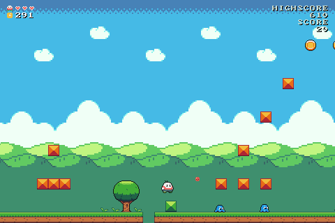
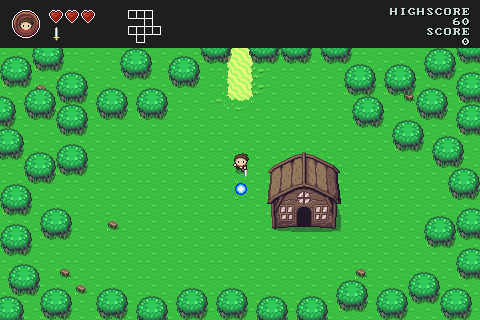
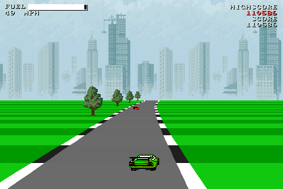

[Home](https://paladin-t.github.io/bitty/index.html) | [Steam](https://store.steampowered.com/app/1386180/) | [Documents](https://paladin-t.github.io/bitty/documents.html) | [About](https://paladin-t.github.io/bitty/about.html)

 **An itty bitty game engine.**

* [About Bitty Engine](#about-bitty-engine)
	* [Features](#features)
	* [Technical specifications](#technical-specifications)
* [Glance](#glance)
	* [Code](#code)
	* [Games](#games)
* [Redistributing](#redistributing)
* [Getting Bitty Engine](#getting-bitty-engine)
* [Compiling from source](#compiling-from-source)
	* [Startup project](#startup-project)
	* [Windows](#windows)
	* [MacOS](#macos)
	* [Linux](#linux)
	* [Other platforms](#other-platforms)
* [Community and contributing](#community-and-contributing)
* [Documentation](#documentation)

## About Bitty Engine


Bitty Engine is a cross-platform itty bitty **Game Engine** and open-source **Framework**. The full featured engine is programmable in Lua and integrated with built-in editors. It keeps the nature of both engine's productivity, and fantasy computer/console's ease to iterate. It boosts your commercial/non-commercial projects, prototypes, game jams, or just thought experiments.

### Features

* `Resources` API
	* `Resources.load(...)`
	* `Resources.wait(...)`
	* `Resources.unload(...)`
	* `Resources.collect(...)`
	* Etc.
* Graphics API
	* Shapes: `plot(...)`, `line(...)`, `circ(...)`, `ellipse(...)`, `rect(...)`, `tri(...)`
	* Text: `text(...)`, `font(...)`, `measure(...)`
	* Texture: `tex(...)`
	* Sprite: `spr(...)`
	* Map: `map(...)`
	* `clip(...)`, `camera(...)`
	* Etc.
* Input API
	* Gamepad
	* Keyboard
	* Mouse and touch
* Audio API
	* Supports MP3, OGG, WAV, etc.
* Libraries
	* Algorithms, `Archive`, `Bytes`, `Color`, `DateTime`, Encoding, `File`, Filesystem, `Image`, `Json`, Math, `Network`, `Platform`, `Web`
* Application interfaces
	* `Application`, `Canvas`, `Project`, `Debug`

### Technical specifications

* Display: defaults to 480x320 pixels, configurable to bigger, smaller or self-adaption
* Audio: 1 BGM channel, 4 SFX channels; supports MP3, OGG, WAV, FLAC, etc.
* Font: supports Bitmap and TrueType
* Code: Lua, supports multiple source files
* Sprite: up to 1024x1024 pixels per frame, up to 1024 frames per sprite
* Map: up to 4096x4096 tiles per page
* Image: either true-color (PNG, JPG, BMP, TGA) or paletted, up to 1024x1024 pixels per file
* Palette: 256 colors with transparency support
* Gamepad: 6 buttons for each pad (D-Pad + A/B), up to 2 players
* Keyboard and mouse: supported

## Glance

### Code

```lua
local obj = nil

function setup()
	obj = Resources.load('gum bot.spr')
	obj:play('move', true, true)
end

function update(delta)
	spr(obj, 208, 128, 64, 64)
end
```

See more [examples](examples).

### Games









## Redistributing


Bitty Engine helps you to make standalone binaries for Windows, MacOS, Linux, and HTML (WebAssembly). It is redistributable for both non-commercial and commercial use without extra fee, your project is totally yours.

Everything is done with Bitty Engine (pro) by nothing more than a few mouse clicks.

Put an image at "../icon.png" relative to executables to customize the icon dynamically. Put an image at "../splash.png" as well to customize the splash; the image could be transparent.

## Getting Bitty Engine

The pro version is available on [Steam](https://store.steampowered.com/app/1386180/).

[](https://store.steampowered.com/app/1386180/)

See [version comparison](versions.md).

## Compiling from source

You can compile a core version from this repository, and customize redistributable binary to:

* Change application icon natively
* Change splash natively (keeping is thankful)
* Encrypt assets in your own way
* Link with 3rd-party libraries
* Introduce your own API
* Bring to other platforms

See the [README](src/README.md) under the "src" directory for details.

A C++14 capable compiler is required, any compiler came after 2014 should be ok. You need to get this repository and its submodules before build:

```sh
git clone https://github.com/paladin-t/bitty.git
cd bitty
git submodule init
git submodule update
```

There are some customizable macros:

* `BITTY_MULTITHREAD_ENABLED[=1]`: indicates whether project code executes on a thread separately from graphics
* `BITTY_DEBUG_ENABLED[=1]`: indicates whether project code debug is enabled; requires `BITTY_MULTITHREAD_ENABLED==1`; disable this to build a pure runner
* `BITTY_NETWORK_ENABLED[=1]`: indicates whether the `Network` API is enabled
* `BITTY_WEB_ENABLED[=1]`: indicates whether the `Web` API is enabled; disable this if you don't need web accessibility
* `BITTY_SPLASH_ENABLED[=1]`: indicates whether the splash is enabled
* `BITTY_EFFECTS_ENABLED[=1]`: whether full screen effects is enabled
* `BITTY_PROJECT_STRATEGY_MAP_BATCH_ENABLED[=0]`: indicates whether map batch is preferred; it might speed up map rendering if enabled, but requires more memory and could be slow with `mset(...)`

### Startup project

Once you have setup and built a binary, it loads from "../data" or "../data.bit" automatically as startup project. Otherwise it shows a programmable workspace.

### Windows

Dependencies: Visual Studio (with C++ development tools installed).

1. Build SDL2
	1. Compile from "lib/sdl/VisualC/SDL.sln"
	2. Execute `lib/sdl/copy_win.cmd`
2. Build SDL2_mixer
	1. Compile from "lib/sdl_mixer/VisualC/SDL_mixer.sln" (need to setup SDL2 including and linking paths from previous step manually)
	2. Execute `lib/sdl_mixer/copy_win.cmd`
3. Build Bitty Engine
	1. Compile from "bitty.sln"

### MacOS

Dependencies: Xcode.

1. Build cURL
	1. Execute:
		```sh
		cd lib/curl
		./MacOSX-Framework
		cd ../..
		```
2. Build SDL2
	1. Compile framework from "lib/sdl/Xcode/SDL/SDL.xcodeproj"
	2. Reveal "SDL2.framework" in Finder
	3. Copy "SDL2.framework" to both "lib/sdl/lib/" and "/Library/Frameworks/" (used in following step)
3. Build SDL2_mixer
	1. Compile framework from "lib/sdl_mixer/Xcode/SDL_mixer.xcodeproj"
	2. Reveal "SDL2_mixer.framework" in Finder
	3. Copy "SDL2_mixer.framework" to "lib/sdl_mixer/lib/"
4. Build Bitty Engine
	1. Compile from "bitty.xcodeproj"

### Linux

Dependencies: CMake, GCC.

1. Build cURL
	1. Execute:
		```sh
		cd lib/curl
		./configure
		make
		cd ../..
		```
	2. Execute `lib/curl/copy_linux.sh`
2. Build SDL2
	1. Execute:
		```sh
		cd lib/sdl
		./configure
		make
		sudo make install
		cd ../..
		```
	2. Execute `lib/sdl/copy_linux.sh`
3. Build SDL2_mixer
	1. Install necessary dependencies to enable extra audio format support, eg. for Ubuntu execute:
		```sh
		sudo apt install libflac-dev libfluidsynth-dev libmodplug-dev libmpg123-dev libopus-dev libopusfile-dev libvorbis-dev
		```
	2. Execute:
		```sh
		cd lib/sdl_mixer
		./configure
		make
		cd ../..
		```
	3. Execute `lib/sdl_mixer/copy_linux.sh`
4. Build Bitty Engine
	1. Execute:
		```sh
		cd bitty.linux
		cmake . && make
		cd ..
		```

### Other platforms

You can also setup your own build pipeline for other platforms. The "lib" and "src" directories are almost all you need. See the [README](src/README.md) under the "src" directory for project structure.

The "platform_*" files contain most platform dependent code.

Note the file dialog library is only usable on desktop builds. Make your own adaption if you need for other platforms.

## Community and contributing

* [Steam](https://store.steampowered.com/app/1386180/)
* [Discord](https://discord.gg/372vb8ct2H)
* [GitHub Discussions](https://github.com/paladin-t/bitty/discussions)
* [Issues](https://github.com/paladin-t/bitty/issues)
* [Pull Requests](https://github.com/paladin-t/bitty/pulls)

## Documentation

* [Reference Manual](https://paladin-t.github.io/bitty/manual.html)
* [Operations](https://paladin-t.github.io/bitty/operations.html)
* [Keycodes](https://paladin-t.github.io/bitty/keycodes.html)
* [Changelog](https://paladin-t.github.io/bitty/changelog.html)
