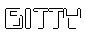
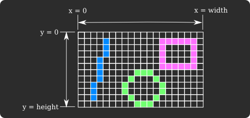

## Reference Manual

[**Manual**](https://paladin-t.github.io/bitty/manual.html) | [Operations](operations)

## Table of Content

* [Fundamental](#fundamental)
	* [Specifications](#specifications)
	* [Project Structure](#project-structure)
		* [In Directory](#in-directory)
		* [Text-based Archive](#text-based-archive)
		* [Binary-based Archive](#binary-based-archive)
	* [Backup](#backup)
	* [Capturing](#capturing)
		* [Screenshot](#screenshot)
		* [GIF](#gif)
* [Programming](#programming)
	* [Lua](#lua)
		* [Syntax](#syntax)
		* [Memory Management](#memory-management)
		* [Standard Libraries](#standard-libraries)
	* [Program Structure](#program-structure)
	* [Libraries](#libraries)
		* [Algorithms](#algorithms)
			* [Noiser](#noiser)
			* [Pathfinder](#pathfinder)
			* [Randomizer](#randomizer)
			* [Raycaster](#raycaster)
			* [Walker](#walker)
		* [Archive](#archive)
		* [Bytes](#bytes)
		* [Color](#color)
		* [Date Time](#date-time)
		* [Encoding](#encoding)
			* [Base64](#base64)
			* [LZ4](#lz4)
		* [File](#file)
		* [Filesystem](#filesystem)
		* [Image](#image)
		* [JSON](#json)
		* [Math](#math)
			* [Structures](#structures)
			* [Intersection Detection](#intersection-detection)
		* [Network](#network)
		* [Platform](#platform)
		* [Promise](#promise)
		* [Stream](#stream)
		* [Web](#web)
	* [Assets and Resources](#assets-and-resources)
		* [Resources](#resources)
		* [Asset](#asset)
		* [Palette Asset](#palette-asset)
		* [Font Asset](#font-asset)
		* [Texture Asset](#texture-asset)
		* [Sprite Asset](#sprite-asset)
		* [Map Asset](#map-asset)
		* [SFX Asset](#sfx-asset)
		* [Music Asset](#music-asset)
	* [Primitives](#primitives)
		* [Basics](#basics)
		* [Shapes](#shapes)
		* [Palette](#palette)
		* [Font](#font)
		* [Texture](#texture)
		* [Sprite](#sprite)
		* [Map](#map)
		* [Audio](#audio)
			* [SFX](#sfx)
			* [Music](#music)
		* [Gamepad](#gamepad)
		* [Keyboard](#keyboard)
		* [Mouse](#mouse)
		* [Camera](#camera)
		* [Clip](#clip)
		* [Blend](#blend)
	* [Application](#application)
		* [Canvas](#canvas)
		* [Project](#project)
		* [Debug](#debug)
* [Import and Export](#import-and-export)
	* [Import](#import)
	* [Export](#export)
* [Building](#building)
	* [Building for Desktop](#building-for-desktop)
	* [Building for HTML](#building-for-html)

[TOP](#reference-manual)

# Fundamental

## Specifications

* Display: defaults to 480x320 pixels, configurable to bigger, smaller or self-adaption
* Audio: 1 BGM channel, 4 SFX channels; supports MP3, OGG, WAV, etc.
* Font: supports Bitmap and TrueType
* Code: Lua, supports multiple source files
* Sprite: up to 1024x1024 pixels per frame, up to 1024 frames per sprite
* Map: up to 4096x4096 tiles per page
* Image: either true-color (PNG, JPG, BMP, TGA) or paletted, up to 1024x1024 pixels per file
* Palette: 256 colors with transparency support
* Gamepad: 6 buttons for each pad (D-Pad + A/B), up to 2 players
* Keyboard and mouse: supported

[TOP](#reference-manual)

## Project Structure

A new created project consists of a meta info asset ("info.json") and an entry source ("main.lua"). The meta info indicates basic information of the project in JSON. The entry is where the project starts to execute. You can add supported existing file or create new blank assets into a project. All text-based assets use Unix LF ('\n') for line ending.

### In Directory

All assets are stored as raw files under a specific directory in this format.

### Text-based Archive

A text-based project archive is a plain text file with the "*.bit" extension, with all assets encoded in printable UTF-8 characters or Base64 string. This format uses Unix LF ('\n') for line ending.

### Binary-based Archive

A binary-based project archive is just a compressed ZIP package replaced with the "*.bit" extension.

[TOP](#reference-manual)

## Backup

Bitty Engine makes backup once you save an asset or a project, click "Project", "Browse Data Directory..." to locate it.

[TOP](#reference-manual)

## Capturing

There are shortcuts to capture canvas during running.

### Screenshot

* F6: take a screenshot

### GIF

* F7: start recording frames
* F8: stop recording frames

[TOP](#reference-manual)

# Programming

## Lua

Bitty project is programmable in the [Lua](https://www.lua.org/) programming language.

### Syntax

Lua is widely used and validated in the software industry, there are a lot of learning materials about the language on the internet. Click to see on the [Wikipedia](https://en.wikipedia.org/wiki/Lua_(programming_language)) or read the [official documentations](https://www.lua.org/docs.html).

Lua is 1-based for list accessing, Bitty Engine follows the same convention for sequenced structures, like `Bytes`, `File`, etc. Otherwise it is 0-based for coordinates and graphical units, like `Noiser`, `Pathfinder`, `Image`, `Sprite`, `Palette`, `Map`, etc.

This document uses a meta method form to describe operators. Eg. `foo:__len()` denotes `#foo`, `foo:__add(bar)` denotes `foo + bar`, `foo:__unm()` denotes `-foo`, etc.

### Memory Management

Lua uses GC to free unused memory automatically, thus you don't have to do that manually most of the time. However resources loaded by `Resources.load(...)` are not, consider unload them properly. See [Resources](#resources) for details.

### Standard Libraries

The ready to use modules, `package`, `coroutine`, `table`, `string`, `math`, `utf8`, are reserved from the original.

The trivial modules, `io`, `os`, `debug`, are removed. Bitty Engine offers alternatives.

Bitty Engine offers some handy built-in functions, some are reserved from the original but the behaviour is improved, some are extended.

**Functions**

* `print(...)`: outputs some values to the console window as message, for debugging purposes
* `warn(...)`: outputs some values to the console window as warn, for debugging purposes
* `error(...)`: outputs some values to the console window as error, and stops execution, for debugging purposes

* `msgbox(msg)`: popups a message box with the specific content
	* `msg`: the message string
* `input(prompt[, default])`: popups an input box
	* `prompt`: the prompt on the box
	* `default`: the default content
	* returns inputted string, or `nil` for canceled

* `exit()`: exits the current execution

[TOP](#reference-manual)

## Program Structure

A conventional entry program of Bitty project is made up of a `setup` function which is called once a program starts, and an `update` which is called periodically:

```lua
function setup()
end

function update(delta)
end
```

Define another `quit` function to run code on execution termination:

```lua
function quit()
end
```

Define `focusLost`, `focusGained` functions to run code on focus changed:

```lua
function focusLost()
end

function focusGained()
end
```

Generally `setup` is used to initial game variables, states, `update` is where gameplay logic and rendering goes, and `quit` is for persisting necessary data on disk. All these five entries are optional.

Bitty Engine uses a timeout mechanism to avoid unexpected infinite loops, it raises an error when any invoking to the entries takes more than 10 seconds by default. The timeout value can be changed by [Debug.setTimeout(...)](#debug).

[TOP](#reference-manual)

## Libraries

### Algorithms

#### Noiser

This module generates 2D or 3D noise values.

**Constructors**

* `Noiser.new()`: constructs a noiser object with

**Methods**

* `noiser:setOption(key, val)`: sets the options value of the specific key
	* `key`: the option key to set
	* `val`: the value to set

Available options:

| Key | Value | Note |
|---|---|---|
| "frequency" | Real number | Defaults to 0.01 |
| "noise_type" | Can be one in "open_simplex2", "open_simplex2s", "cellular", "perlin", "value_cubic", "value" | Defaults to "open_simplex2" |
| "rotation_type_3d" | Can be one in "none", "improve_xy_planes", "improve_xz_planes" | Defaults to "none" |
| "fractal_type" | Can be one in "none", "fbm", "ridged", "pingpong", "domain_warp_progressive", "domain_warp_independent" | Defaults to "none" |
| "fractal_octaves" | Integer | Defaults to 3 |
| "fractal_lacunarity" | Real number | Defaults to 2.0 |
| "fractal_gain" | Real number | Defaults to 0.5 |
| "fractal_weighted_strength" | Real number | Defaults to 0.0 |
| "fractal_pingpong_strength" | Real number | Defaults to 2.0 |
| "cellular_distance_function" | Can be one in "euclidean", "euclidean_sq", "manhattan", "hybrid" | Defaults to "euclidean_sq" |
| "cellular_return_type" | Can be one in "cell_value", "distance", "distance2", "distance2_add", "distance2_sub", "distance2_mul", "distance2_div" | Defaults to "distance" |
| "cellular_jitter" | Real number | Defaults to 1.0 |
| "domain_warp_type" | Can be one in "open_simplex2", "open_simplex2_reduced", "basic_grid" | Defaults to "open_simplex2" |
| "domain_warp_amplitude" | Real number | Defaults to 1.0 |

* `noiser:seed(seed)`: seeds the noiser for all noise types
	* `seed`: the seed integer
* `noiser:get(pos)`: gets the value at the specific position
	* `pos`: the position to get, either `Vec2` or `Vec3`
	* returns noise value, with range of values from -1.0 to 1.0
* `noiser:domainWarp(pos)`: applies domain warping at the specific position
	* `pos`: the position to warp, either `Vec2` or `Vec3`
	* returns warped position

#### Pathfinder

This module performs a pathfinding algorithm on 2D grids.

**Constructors**

* `Pathfinder.new(w, n, e, s)`: constructs a pathfinder object with finite borders
	* `w`: the west edge, minimum in the x direction
	* `n`: the north edge, minimum in the y direction
	* `e`: the east edge, maximum in the x direction
	* `s`: the south edge, maximum in the y direction

**Object Fields**

* `pathfinder.diagonalCost`: gets or sets the walking cost of diagonal direction, defaults to 1.414; set to -1 for not walkable

**Methods**

* `pathfinder:get(pos)`: gets the walking cost of a prefilled grid at the specific position
	* `pos`: the position to get
	* returns walking cost
* `pathfinder:set(pos, cost)`: sets the walking cost of a grid, initializes a cost matrix with 1 for all grids when first calling to this function
	* `pos`: the position to set
	* `cost`: the cost value to set
* `pathfinder:clear()`: clears prefilled matrix and internal cached data
* `pathfinder:solve(beginPos, endPos, eval)`: resolves for a possible path with the specific evaluator
	* `beginPos`: the beginning position
	* `endPos`: the ending position
	* `eval`: in form of `function (pos) return number end`, an invokable object which accepts position and returns the walking cost at that point
	* returns an approachable path, in a list of `Vec2`, could be empty
* `pathfinder:solve(beginPos, endPos)`: resolves for a possible path with the prefilled cost matrix
	* `beginPos`: the beginning position
	* `endPos`: the ending position
	* returns an approachable path, in a list of `Vec2`, could be empty

Grid coordinates can be any integer, with range of values from -32,767 to 32,767. A cost matrix will be prefilled once calling the `pathfinder:set(...)` function; this data exists until calling `pathfinder:clear()`. The `pathfinder:solve(...)` function prefers to use invokable to get grid cost, and falls to use prefilled matrix if no evaluator provided.

Walking cost is combined with two parts by multiplicative: neighbor cost and map cost. Neighbor cost stands for how much does it cost to walk from the current grid to its neighbor directions as following, in which `D` defaults to 1.414:

```
 _________________
|     |     |     |
|  D  |  1  |  D  |
|_____|_____|_____|
|     |     |     |
|  1  |     |  1  |
|_____|_____|_____|
|     |     |     |
|  D  |  1  |  D  |
|_____|_____|_____|
```

Pathfinder retrieves grid cost from either an evaluator or prefilled matrix. All cost states must be immutable during calling the `pathfinder:solve(...)` function. It's not walkable if either part of the cost combination results -1; positive cost means walkable, and the pathfinder prefers lower cost grids.

#### Randomizer

This module provide a random algorithm organized by object, other than the built-in random function in Lua.

**Constructors**

* `Random.new()`: constructs a randomizer object

**Methods**

* `random:seed([seed])`: seeds the randomizer
	* `seed`: the seed; omit to seed with the current time
* `random:next(low, up)`: generates a random number
	* `low`: the low bound
	* `up`: the up bound
	* returns a pseudo random integer with uniform distribution in the range [m, n]
* `random:next(n)`: generates a random number
	* returns equivalent to `random:next(1, n)` for a positive `n`; returns an integer with all bits random for a zero `n`
* `random:next()`: generates a random number
	* returns a pseudo random float with uniform distribution in the range [0, 1)

#### Raycaster

This module performs a raycasting algorithm on 2D grids.

**Constructors**

* `Raycaster.new()`: constructs a raycaster object

**Object Fields**

* `raycaster.tileSize`: gets or sets the tile size as `Vec2`, defaults to 8x8
* `raycaster.offset`: gets or sets the raycaster offset as `Vec2`, defaults to 0, 0

**Methods**

* `raycaster:solve(rayPos, rayDir, eval)`: resolves for raycasting
	* `rayPos`: the ray position
	* `rayDir`: the ray direction
	* `eval`: in form of `function (pos) return boolean end`, an invokable object which accepts position and returns `true` for blocked, `false` for pass
	* returns an approximate intersection position as `Vec2` or `nil`, and a secondary value for intersection index as `Vec2` or `nil`

#### Walker

This module performs a smooth walking algorithm on 2D grids.

**Constants**

* `Walker.None`
* `Walker.Left`
* `Walker.Right`
* `Walker.Up`
* `Walker.Down`

**Constructors**

* `Walker.new()`: constructs a walker object

**Object Fields**

* `walker.objectSize`: gets or sets the object size as `Vec2`, defaults to 8x8
* `walker.tileSize`: gets or sets the tile size as `Vec2`, defaults to 8x8
* `walker.offset`: gets or sets the walker offset as `Vec2`, defaults to 0, 0

**Methods**

* `walker:solve(objPos, expDir, eval, slidable = 5)`: resolves for a walking step
	* `objPos`: the object position
	* `expDir`: the expected direction
	* `eval`: in form of `function (pos) return boolean, enum end`, an invokable object which accepts position and returns `true` for blocked, `false` for pass; in addition this evaluator can return a secondary value in `Walker.None`, `Walker.Left`, `Walker.Right`, `Walker.Up`, `Walker.Down` for one-way walk
	* `slidable`: non-zero for slidable at edge, with range of values from 0 to 10
	* returns a resolved directional `Vec2`, could be zero

### Archive

This module offers manipulations for a ZIP package.

**Constructors**

* `Archive.new()`: constructs an archive object

**Methods**

* `archive:open(path, access = Stream.Read)`: opens an archive file for reading or writing
	* `path`: the archive file path
	* `access`: can be one in `Stream.Read`, `Stream.Write`, `Stream.Append`, for reading, truncated writing, non-truncated writing respectively
	* returns `true` for success, otherwise `false`
* `archive:close()`: closes an opened archive
	* returns `true` for success, otherwise `false`
* `archive:all()`: gets all entry names in the archive
	* returns an entry list, in a list of string, could be empty or `nil`
* `archive:exists(entry)`: gets whether the specific entry exists in the archive
	* `entry`: the entry name to look for
	* returns `true` for exists, otherwise `false`
* `archive:make(entry)`: makes an entry in the archive
	* `entry`: the entry name to make
	* returns `true` for success, otherwise `false`
* `archive:toBytes(entry, bytes)`: reads the specific entry and writes to `Bytes`
	* `entry`: the entry name to read
	* `bytes`: the `Bytes` to receive, its cursor will be at the end
	* returns `bytes` for success, otherwise `nil`
* `archive:fromBytes(entry, bytes)`: writes the specific entry from `Bytes`
	* `entry`: the entry name to write
	* `bytes`: the `Bytes` to retrieve from start till end, its cursor won't be moved
	* returns `true` for success, otherwise `false`
* `archive:toFile(entry, path)`: reads the specific entry and writes to file
	* `entry`: the entry name to read
	* `path`: the file path to receive
	* returns `true` for success, otherwise `false`
* `archive:fromFile(entry, path)`: writes the specific entry from file
	* `entry`: the entry name to write
	* `path`: the file path to retrieve
	* returns `true` for success, otherwise `false`
* `archive:toDirectory(path)`: reads all the entries and writes to directory
	* `path`: the directory path to receive
	* returns `true` for success, otherwise `false`
* `archive:fromDirectory(path)`: writes all the entries from directory
	* `path`: the directory path to retrieve
	* returns `true` for success, otherwise `false`

### Bytes

Being the same as Lua list, `Bytes` index starts from 1. Implements a `Stream` protocol as memory buffer.

**Constructors**

* `Bytes.new()`: constructs a bytes object

**Operators**

* `=bytes[index]`: reads a byte from the specific index
	* `index`: starts from 1
	* returns byte
* `bytes[index]=`: writes a byte to the specific index
	* `index`: starts from 1
* `bytes:__len()`: gets the length in bytes

**Methods**

* `bytes:peek()`: peeks the reading/writing cursor
	* returns the cursor, starts from 1
* `bytes:poke(index)`: pokes the reading/writig cursor
	* `index`: starts from 1
	* returns `true` for success, otherwise `false`
* `bytes:count()`: gets the length in bytes
	* returns the length in bytes
* `bytes:empty()`: gets whether the `Bytes` is empty
	* returns `true` for empty, otherwise `false`
* `bytes:endOfStream()`: gets whether the cursor is at the end
	* returns `true` for end, otherwise `false`
* `bytes:readByte()`: reads a byte and moves the cursor forward
	* returns byte
* `bytes:readInt16()`: reads a 16-bit signed integer and moves the cursor forward
	* returns 16-bit signed integer
* `bytes:readUInt16()`: reads a 16-bit unsigned integer and moves the cursor forward
	* returns 16-bit unsigned integer
* `bytes:readInt32()`: reads a 32-bit signed integer and moves the cursor forward
	* returns 32-bit signed integer
* `bytes:readUInt32()`: reads a 32-bit unsigned integer and moves the cursor forward
	* returns 32-bit unsigned integer
* `bytes:readInt64()`: reads a 64-bit signed integer and moves the cursor forward
	* returns 64-bit signed integer
* `bytes:readSingle()`: reads a single precision real number and moves the cursor forward
	* returns single precision real number
* `bytes:readDouble()`: reads a double precision real number and moves the cursor forward
	* returns double precision real number
* `bytes:readBytes([expSize[, bytes_]])`: reads some bytes and moves the cursor forward
	* `expSize`: optional, the expected size in bytes to read; omit to read till end
	* `bytes_`: optional, `Bytes` to receive, its content will be cleared; omit to return a new `Bytes`
	* returns the target `Bytes`, its cursor will be at the end
* `bytes:readString([expSize])`: reads some text and moves the cursor forward
	* `expSize`: optional, the expected size in bytes to read; omit to read till end
	* returns the read string
* `bytes:readLine()`: reads a line of text and moves the cursor forward
	* returns the read line
* `bytes:writeByte(val)`: writes a byte and moves the cursor forward
	* `val`: the byte to write
	* returns the written size in bytes
* `bytes:writeInt16(val)`: writes a 16-bit signed integer and moves the cursor forward
	* `val`: the 16-bit signed integer to write
	* returns the written size in bytes
* `bytes:writeUInt16(val)`: writes a 16-bit unsigned integer and moves the cursor forward
	* `val`: the 16-bit unsigned integer to write
	* returns the written size in bytes
* `bytes:writeInt32(val)`: writes a 32-bit signed integer and moves the cursor forward
	* `val`: the 32-bit signed integer to write
	* returns the written size in bytes
* `bytes:writeUInt32(val)`: writes a 32-bit unsigned integer and moves the cursor forward
	* `val`: the 32-bit unsigned integer to write
	* returns the written size in bytes
* `bytes:writeInt64(val)`: writes a 64-bit signed integer and moves the cursor forward
	* `val`: the 64-bit signed integer to write
	* returns the written size in bytes
* `bytes:writeSingle(val)`: writes a single precision real number and moves the cursor forward
	* `val`: the single precision real number to write
	* returns the written size in bytes
* `bytes:writeDouble(val)`: writes a double precision real number and moves the cursor forward
	* `val`: the double precision real number to write
	* returns the written size in bytes
* `bytes:writeBytes(bytes_[, expSize])`: writes some bytes and moves the cursor forward
	* `bytes_`: the `Bytes` to write from start till end, its cursor won't be moved
	* `expSize`: optional, the expected size in bytes to write; omit to write till `bytes_`'s end
	* returns the written size in bytes
* `bytes:writeString(val)`: writes some text and moves the cursor forward
	* `val`: the string to write
	* returns the written size in bytes
* `bytes:writeLine(val)`: writes a line of text and moves the cursor forward
	* `val`: the line to write
	* returns the written size in bytes
* `bytes:get(index)`: gets a byte at the specific index, doesn't moves the cursor
	* `index`: the index to get, starts from 1
	* returns byte
* `bytes:set(index, val)`: sets a byte to the specific index, doesn't moves the cursor
	* `index`: the index to set, starts from 1
	* `val`: the byte to set
* `bytes:resize(expSize)`: resizes the `Bytes`
	* `expSize`: the expected new size
* `bytes:clear()`: clears all content and resets the cursor

### Color

**Constructors**

* `Color.new(r, g, b, a = 255)`: constructs a color object
	* `r`: the red component, with range of values from 0 to 255
	* `g`: the green component, with range of values from 0 to 255
	* `b`: the blue component, with range of values from 0 to 255
	* `a`: the alpha component, with range of values from 0 to 255
* `Color.new()`: constructs a color object as white

**Operators**

* `color:__add(color_)`: adds with another `Color` componentwise
* `color:__sub(color_)`: subtracts by another `Color` componentwise
* `color:__mul(num)`: multiplies with another number
* `color:__mul(color_)`: multiplies with another `Color` componentwise
* `color:__unm()`: takes the opposite `Color` componentwise
* `color:__eq(color_)`: compares with another `Color` for equality

**Object Fields**

* `color.r`: gets or sets the red component
* `color.g`: gets or sets the green component
* `color.b`: gets or sets the blue component
* `color.a`: gets or sets the alpha component

**Methods**

* `color:toRGBA()`: converts the `Color` to an RGBA integer in little-endian
* `color:fromRGBA(int)`: fills the `Color` with an RGBA integer in little-endian

### Date Time

**Static Functions**

* `DateTime.now()`: gets the current time
	* returns `sec` (0-based), `min` (0-based), `hr` (0-based, since midnight), `mday` (1-based, day of the month), `mo` (1-based), `yr` (since C.E.), `wday` (1-based, days since Sun.), `yday` (1-based, days since 1, Jan.), `isdst` (daylight saving time flag)
* `DateTime.ticks()`: gets a high precision timestamp
	* returns timestamp in nanoseconds
* `DateTime.toMilliseconds(ticks)`: converts nanoseconds to milliseconds
	* `ticks`: nanoseconds
	* returns milliseconds
* `DateTime.fromMilliseconds(ms)`: converts milliseconds to nanoseconds
	* `ms`: milliseconds
	* returns nanoseconds
* `DateTime.toSeconds(ticks)`: converts nanoseconds to seconds
	* `ticks`: nanoseconds
	* returns seconds
* `DateTime.fromSeconds(sec)`: converts seconds to nanoseconds
	* `sec`: seconds
	* returns nanoseconds

### Encoding

#### Base64

**Static Functions**

* `Base64.encode(bytes)`: encodes the specific `Bytes` to Base64 string
	* `bytes`: the `Bytes` to encode from start till end, its cursor won't be moved
	* returns Base64 string
* `Base64.decode(txt)`: decodes the specific Base64 string to `Bytes`
	* `txt`: Base64 string to decode
	* returns `Bytes`, its cursor will be at the end

#### LZ4

**Static Functions**

* `Lz4.encode(bytes)`: encodes the specific `Bytes` to LZ4 encoded `Bytes`
	* `bytes`: the `Bytes` to encode from start till end, its cursor won't be moved
	* returns LZ4 encoded `Bytes`
* `Lz4.decode(bytes)`: decodes the specific LZ4 `Bytes` to `Bytes`
	* `bytes`: LZ4 `Bytes` to decode
	* returns `Bytes`, its cursor will be at the end

### File

Being the same as Lua list, `File` index starts from 1. Implements a `Stream` protocol as file on disk.

**Constructors**

* `File.new()`: constructs a file object

**Operators**

* `file:__len()`: gets the length in bytes

**Methods**

* `file:open(path, access = Stream.Read)`: opens a file for reading or writing
	* `path`: the file path
	* `access`: can be one in `Stream.Read`, `Stream.Write`, `Stream.Append`, `Stream.ReadWrite`, for reading, truncated writing, non-truncated writing, reading and writing respectively
	* returns `true` for success, otherwise `false`
* `file:close()` closes an opened file
	* returns `true` for success, otherwise `false`
* `file:peek()`: peeks the reading/writing cursor
	* returns the cursor, starts from 1
* `file:poke(index)`: pokes the reading/writing cursor
	* `index`: starts from 1
	* returns `true` for success, otherwise `false`
* `file:count()`: gets the length in bytes
	* returns the length in bytes
* `file:empty()`: gets whether the `File` is empty
	* returns `true` for empty, otherwise `false`
* `file:endOfStream()`: gets whether the cursor is at the end
	* returns `true` for end, otherwise `false`
* `file:readByte()`: reads a byte and moves the cursor forward
	* returns byte
* `file:readInt16()`: reads a 16-bit signed integer and moves the cursor forward
	* returns 16-bit signed integer
* `file:readUInt16()`: reads a 16-bit unsigned integer and moves the cursor forward
	* returns 16-bit unsigned integer
* `file:readInt32()`: reads a 32-bit signed integer and moves the cursor forward
	* returns 32-bit signed integer
* `file:readUInt32()`: reads a 32-bit unsigned integer and moves the cursor forward
	* returns 32-bit unsigned integer
* `file:readInt64()`: reads a 64-bit signed integer and moves the cursor forward
	* returns 64-bit signed integer
* `file:readSingle()`: reads a single precision real number and moves the cursor forward
	* returns single precision real number
* `file:readDouble()`: reads a double precision real number and moves the cursor forward
	* returns double precision real number
* `file:readBytes([expSize[, bytes]])`: reads some bytes and moves the cursor forward
	* `expSize`: optional, the expected size in bytes to read; omit to read till end
	* `bytes`: optional, `Bytes` to receive, its content will be cleared; omit to return a new `Bytes`
	* returns the target `Bytes`, its cursor will be at the end
* `file:readString([expSize])`: reads some text and moves the cursor forward
	* `expSize`: optional, the expected size in bytes to read; omit to read till end
	* returns the read string
* `file:readLine()`: reads a line of text and moves the cursor forward
	* returns the read line
* `file:writeByte()`: writes a byte and moves the cursor forward
	* `val`: the byte to write
	* returns the written size in bytes
* `file:writeInt16()`: writes a 16-bit signed integer and moves the cursor forward
	* `val`: the 16-bit signed integer to write
	* returns the written size in bytes
* `file:writeUInt16()`: writes a 16-bit unsigned integer and moves the cursor forward
	* `val`: the 16-bit unsigned integer to write
	* returns the written size in bytes
* `file:writeInt32()`: writes a 32-bit signed integer and moves the cursor forward
	* `val`: the 32-bit signed integer to write
	* returns the written size in bytes
* `file:writeUInt32()`: writes a 32-bit unsigned integer and moves the cursor forward
	* `val`: the 32-bit unsigned integer to write
	* returns the written size in bytes
* `file:writeInt64()`: writes a 64-bit signed integer and moves the cursor forward
	* `val`: the 64-bit signed integer to write
	* returns the written size in bytes
* `file:writeSingle()`: writes a single precision real number and moves the cursor forward
	* `val`: the single precision real number to write
	* returns the written size in bytes
* `file:writeDouble()`: writes a double precision real number and moves the cursor forward
	* `val`: the double precision real number to write
	* returns the written size in bytes
* `file:writeBytes(bytes[, expSize])`: writes some bytes and moves the cursor forward
	* `bytes`: the `Bytes` to write from start till end, its cursor won't be moved
	* `expSize`: optional, the expected size in bytes to write; omit to write till `bytes`'s end
	* returns the written size in bytes
* `file:writeString(val)`: writes some text and moves the cursor forward
	* `val`: the string to write
	* returns the written size in bytes
* `file:writeLine(val)`: writes a line of text and moves the cursor forward
	* `val`: the line to write
	* returns the written size in bytes

### Filesystem

**Static Functions**

* `Path.combine(...)`: combines a number of paths
	* returns combined path
* `Path.split(full)`: splits the specific path into parts
	* returns `name`, `ext`, `parent`
* `Path.existsFile(path)`: gets whether the specific file exists
	* `path`: the file path
	* returns `true` for exists, otherwise `false`
* `Path.existsDirectory(path)`: gets whether the specific directory exists
	* `path`: the directory path
	* returns `true` for exists, otherwise `false`
* `Path.copyFile(src, dst)`: copies the specific file to a new path
	* `src`: the source path
	* `dst`: the destination path
	* returns `true` for success, otherwise `false`
* `Path.copyDirectory(src, dst)`: copies the specific directory to a new path recursively
	* `src`: the source path
	* `dst`: the destination path
	* returns `true` for success, otherwise `false`
* `Path.moveFile(src, dst)`: moves the specific file to a new path
	* `src`: the source path
	* `dst`: the destination path
	* returns `true` for success, otherwise `false`
* `Path.moveDirectory(src, dst)`: moves the specific directory to a new path recursively
	* `src`: the source path
	* `dst`: the destination path
	* returns `true` for success, otherwise `false`
* `Path.removeFile(path, toTrashBin)`: removes the specific file
	* `path`: the file path
	* `toTrashBin`: `true` to remove to the trash bin, otherwise remove permanently
	* returns `true` for success, otherwise `false`
* `Path.removeDirectory(path, toTrashBin)`: removes the specific directory recursively
	* `path`: the directory path
	* `toTrashBin`: `true` to remove to the trash bin, otherwise remove permanently
	* returns `true` for success, otherwise `false`
* `Path.touchFile(path)`: tries to create a file at the specific path, will touch its ancestors
	* `path`: the file path
	* returns `true` for success, otherwise `false`
* `Path.touchDirectory(path)`: tries to create a directory at the specific path, will touch its ancestors
	* `path`: the directory path
	* returns `true` for success, otherwise `false`

**Static Variables**

* `Path.executableFile`: readonly, gets the executable file path
* `Path.documentDirectory`: readonly, gets the documents directory path
* `Path.writableDirectory`: readonly, gets the writable directory path

**Constructors**

* `FileInfo.new(path)`: constructs a file information object with the specific path
	* `path`: the file path

* `DirectoryInfo.new(path)`: constructs a directory information object with the specific path
	* `path`: the directory path

**Methods**

* `fileInfo:fullPath()`: gets the full path
	* returns the full path
* `fileInfo:parentPath()`: gets the path of the parent directory
	* returns the path of the parent directory
* `fileInfo:fileName()`: gets the file name
	* returns the file name, without extension
* `fileInfo:extName()`: gets the extension name
	* returns the extension name, without dot
* `fileInfo:empty()`: gets whether the file represented by the `FileInfo` is empty
	* returns `true` if empty, otherwise `false`
* `fileInfo:exists()`: gets whether the file represented by the `FileInfo` exists
	* returns `true` for exists, otherwise `false`
* `fileInfo:make()`: makes a file represented by the `FileInfo` if it doesn't exist, fails if its ancestors don't exist
	* returns `true` for success, otherwise `false`
* `fileInfo:copyTo(dst)`: copies the file represented by the `FileInfo` to a new path
	* `dst`: the destination path
	* returns `true` for success, otherwise `false`
* `fileInfo:moveTo(dst)`: moves the file represented by the `FileInfo` to a new path
	* `dst`: the destination path
	* returns `true` for success, otherwise `false`
* `fileInfo:remove(toTrashBin)`: removes the file represented by the `FileInfo`
	* `toTrashBin`: `true` to remove to the trash bin, otherwise remove permanently
	* returns `true` for success, otherwise `false`
* `fileInfo:rename(newName[, newExt])`: renames the file represented by the `FileInfo`
	* `newName`: the new file name
	* `newExt`: the new extension name; omit to keep the old
	* returns `true` for success, otherwise `false`
* `fileInfo:parent()`: gets the `DirectoryInfo` of the `FileInfo`'s parent
	* returns the `DirectoryInfo` of its parent
* `fileInfo:readAll()`: reads all content of the file represented by the `FileInfo` as string
	* returns the content string

* `directoryInfo:fullPath()`: gets the full path
	* returns the full path
* `directoryInfo:parentPath()`: gets the path of the parent directory
	* returns the path of the parent directory
* `directoryInfo:dirName()`: gets the directory name
	* returns the directory name
* `directoryInfo:empty()`: gets whether the directory represented by the `DirectoryInfo` is empty
	* returns `true` if empty, otherwise `false`
* `directoryInfo:exists()`: gets whether the directory represented by the `DirectoryInfo` exists
	* returns `true` for exists, otherwise `false`
* `directoryInfo:make()`: makes a directory represented by the `DirectoryInfo` if it doesn't exist, fails if its ancestors don't exist
	* returns `true` for success, otherwise `false`
* `directoryInfo:copyTo(dst)`: copies the directory represented by the `DirectoryInfo` to a new path
	* `dst`: the destination path
	* returns `true` for success, otherwise `false`
* `directoryInfo:moveTo(dst)`: moves the directory represented by the `DirectoryInfo` to a new path
	* `dst`: the destination path
	* returns `true` for success, otherwise `false`
* `directoryInfo:remove(toTrashBin)`: removes the directory represented by the `DirectoryInfo`
	* `toTrashBin`: `true` to remove to the trash bin, otherwise remove permanently
	* returns `true` for success, otherwise `false`
* `directoryInfo:rename(newName)`: renames the directory represented by the `DirectoryInfo`
	* `newName`: the new directory name
	* returns `true` for success, otherwise `false`
* `directoryInfo:getFiles(pattern = "*.*", recursive = false)`: gets sub-files under the directory represented by the `DirectoryInfo`
	* `pattern`: lookup pattern, supports wildcards
	* `recursive`: whether lookup its sub-directories
	* returns a list of `FileInfo` objects
* `directoryInfo:getDirectories(recursive = false)`: gets sub-directories under the directory represented by the `DirectoryInfo`
	* `recursive`: whether lookup its sub-directories
	* returns a list of `DirectoryInfo` objects
* `directoryInfo:parent()`: gets the `DirectoryInfo` of this `DirectoryInfo`'s parent
	* returns the `DirectoryInfo` of its parent

### Image

**Constructors**

* `Image.new(palette)`: constructs an image object with the specific `Palette` asset
	* `palette`: the `Palette` loaded by `Resources.load(...)`
* `Image.new()`: constructs a true-color image object

**Object Fields**

* `image.channels`: readonly, gets the channels of the `Image`, 1 for paletted, 4 for true-color
* `image.width`: readonly, gets the width of the `Image`
* `image.height`: readonly, gets the height of the `Image`

**Methods**

* `image:resize(width, height, stretch = true)`: resizes the `Image` with the specific size; cannot stretch paletted image
	* `width`: the width
	* `height`: the height
	* `stretch`: `true` to stretch the image, otherwise to clip
	* returns `true` for success, otherwise `false`
* `image:get(x, y)`: gets the `Color` or `Palette` index at the specific index
	* `x`: starts from 0
	* `y`: starts from 0
	* returns `Color` or palette index
* `image:set(x, y, val)`: sets the `Color` or `Palette` index at the specific index
	* `x`: starts from 0
	* `y`: starts from 0
	* `val`: `Color` or `Palette` index
	* returns `true` for success, otherwise `false`
* `image:fromImage(img)`: loads content from another `Image`
	* `img`: the specific `Image` to load
	* returns `true` for success, otherwise `false`
* `image:fromBlank(width, height, paletted = 0)`: loads blank content
	* `width`: the specific width
	* `height`: the specific height
	* `paletted`: 0 for true-color, non-zero for paletted
	* returns `true` for success, otherwise `false`
* `image:toBytes(bytes, type = "png")`: encodes the `Image` to `Bytes`
	* `bytes`: the `Bytes` to receive, its cursor will be at the end
	* `type`: can be one in "png", "jpg", "bmp", "tga", "img"
	* returns `bytes` for success, otherwise `nil`
* `image:fromBytes(bytes)`: decodes the specific `Bytes`
	* `bytes`: the `Bytes` to retrieve from start till end, its cursor won't be moved
	* returns `true` for success, otherwise `false`

### JSON

**Constructors**

* `Json.new()`: constructs a JSON object

**Methods**

* `json:toString(pretty = true)`: serializes the `Json` to string
	* `pretty`: whether to serialize in a friendly to read format
	* returns serialized string
* `json:fromString(txt)`: parses `Json` data from the specific string
	* `txt`: the text to parse
	* returns `true` for success, otherwise `false`
* `json:toTable()`: serializes the `Json` to Lua table
	* returns serialized Lua table
* `json:fromTable(tbl)`: parses `Json` data from the specific Lua table, ignores incompatible data types
	* `tbl`: the table to parse
	* returns `true` for success, otherwise `false`

### Math

#### Structures

**Static Functions**

* `Rect.byXYWH(x, y, w, h)`: constructs a rectangle object in real numbers by position and size

* `Recti.byXYWH(x, y, w, h)`: constructs a rectangle object in integers by position and size

**Constructors**

* `Vec2.new([x, y])`: constructs a vector object in 2 dimensions

* `Vec3.new([x, y, z])`: constructs a vector object in 3 dimensions

* `Vec4.new([x, y, z, w])`: constructs a vector object in 4 dimensions

* `Rect.new([x0, y0, x1, y1])`: constructs a rectangle object in real numbers by points

* `Recti.new([x0, y0, x1, y1])`: constructs a rectangle object in integers by points

* `Rot.new([s, c])`: constructs a rotation object

**Operators**

* `vec2:__add(vec2_)`: adds with another `Vec2` componentwise
* `vec2:__sub(vec2_)`: subtracts by another `Vec2` componentwise
* `vec2:__mul(num)`: multiplies with another number
* `vec2:__mul(vec2_)`: multiplies with another `Vec2` componentwise
* `vec2:__unm()`: takes the opposite `Vec2` componentwise
* `vec2:__len()`: gets the length of the `Vec2`
* `vec2:__eq(vec2_)`: compares with another `Vec2` for equality

* `vec3:__add(vec3_)`: adds with another `Vec3` componentwise
* `vec3:__sub(vec3_)`: subtracts by another `Vec3` componentwise
* `vec3:__mul(num)`: multiplies with another number
* `vec3:__mul(vec3_)`: multiplies with another `Vec3` componentwise
* `vec3:__unm()`: takes the opposite `Vec3` componentwise
* `vec3:__len()`: gets the length of the `Vec3`
* `vec3:__eq(vec3_)`: compares with another `Vec3` for equality

* `vec4:__add(vec4_)`: adds with another `Vec4` componentwise
* `vec4:__sub(vec4_)`: subtracts by another `Vec4` componentwise
* `vec4:__mul(num)`: multiplies with another number
* `vec4:__mul(vec4_)`: multiplies with another `Vec4` componentwise
* `vec4:__unm()`: takes the opposite `Vec4` componentwise
* `vec4:__eq(vec4_)`: compares with another `Vec4` for equality

* `rot:__mul(vec2)`: rotates another `Vec2`
* `rot:__mul(rot_)`: rotates another `Rot`
* `rot:__eq(rot_)`: compares with another `Rot` for equality

* `rect:__eq(rect_)`: compares with another `Rect` for equality

* `recti:__eq(recti_)`: compares with another `Recti` for equality

**Object Fields**

* `vec2.x`: gets or sets the x component
* `vec2.y`: gets or sets the y component
* `vec2.normalized`: readonly, gets the normalized `Vec2`
* `vec2.length`: readonly, gets the length
* `vec2.angle`: readonly, gets the rotated angle in radians as a vector

* `vec3.x`: gets or sets the x component
* `vec3.y`: gets or sets the y component
* `vec3.z`: gets or sets the z component
* `vec3.normalized`: readonly, gets the normalized `Vec3`
* `vec3.length`: readonly, gets the length

* `rect4.x`: gets or sets the x component
* `rect4.y`: gets or sets the y component
* `rect4.z`: gets or sets the z component
* `rect4.w`: gets or sets the w component

* `rot.s`: gets or sets the sine component
* `rot.c`: gets or sets the cosine component
* `rot.angle`: gets or sets the angle in radians denoted by the `Rot`

* `rect.x0`: gets or sets the first x component
* `rect.y0`: gets or sets the first y component
* `rect.x1`: gets or sets the second x component
* `rect.y1`: gets or sets the second y component

* `recti.x0`: gets or sets the first x component
* `recti.y0`: gets or sets the first y component
* `recti.x1`: gets or sets the second x component
* `recti.y1`: gets or sets the second y component

**Methods**

* `vec2:normalize()`: normalizes the `Vec2`
	* returns the original length before normalization
* `vec2:distanceTo(vec2_)`: gets the distance between this and another `Vec2`
	* returns the distance number
* `vec2:dot(vec2_)`: applies a dot multiplication
	* returns the dot result as number
* `vec2:cross(num)`: applies a cross multiplication
	* returns the cross `Vec2`
* `vec2:cross(vec2_)`: applies a cross multiplication
	* returns the cross result as number
* `vec2:angleTo(vec2_)`: gets the angle between this and another `Vec2` as vectors
	* returns the angle in radians
* `vec2:rotated(angle[, pivot])`: gets the rotated `Vec2`
	* `angle`: the angle to rotate
	* `pivot`: the pivot `Vec2` to rotate around
	* returns the rotated `Vec2`
* `vec2:rotated(rot[, pivot])`: gets the rotated `Vec2`
	* `rot`: the `Rot` to rotate
	* `pivot`: the pivot `Vec2` to rotate around
	* returns the rotated `Vec2`

* `vec3:normalize()`: normalizes the `Vec3`
	* returns the original length before normalization
* `vec3:dot(vec3_)`: applies a dot multiplication
	* returns the dot result as number

* `rect:xMin()`: gets the minimum x component
* `rect:yMin()`: gets the minimum y component
* `rect:xMax()`: gets the maximum x component
* `rect:xMax()`: gets the maximum y component
* `rect:width()`: gets the width, equals to `rect:xMax() - rect:xMin()`
* `rect:height()`: gets the height, equals to `rect:yMax() - rect:yMin()`

* `recti:xMin()`: gets the minimum x component
* `recti:yMin()`: gets the minimum y component
* `recti:xMax()`: gets the maximum x component
* `recti:xMax()`: gets the maximum y component
* `recti:width()`: gets the width, equals to `rect:xMax() - rect:xMin() + 1`
* `recti:height()`: gets the height, equals to `rect:yMax() - rect:yMin() + 1`

#### Intersection Detection

**Static Functions**

* `Math.intersects(shapeA, shapeB)`: detects whether two shapes intersects with each other
	* `shapeA`: the first shape
	* `shapeB`: the second shape
	* returns `true` for intersects, otherwise `false`

Both shape parameters can be:

* Point: `Vec2`
* Line (segment): `Vec4`, `x`, `y` for first point, `z`, `w` for second
* Circle: `Vec3`, `x`, `y` for center, `z` for radius
* AABB: `Rect`; `Recti` is supported as well, but converted to `Rect` internally to determine against other shapes except for another `Recti`

### Network

**Constants**

* `Network.None`
* `Network.Udp`
* `Network.Tcp`

**Constructors**

* `Network.new(onRecv[, onEstb[, onDisc]])`: constructs a network object
	* `onRecv`: callback on received
	* `onEstb`: callback on connection established
	* `onDisc`: callback on connection disconnected

The callback of received event is an invokable in form of `function (data, size, addr) end`, which accepts three parameters respectively represent for the data has been just received, the data size corresponding to specific types, and the remote adress string. The type of the first parameter is determined by the "data_type" option.

The callback of connection established is an invokable in form of `function (addr) end`, which accepts a parameter represents for the remote address string; `nil` for failure for outcoming connection. It's invoked when either incoming or outcoming connection established; ignored by UDP.

The callback of disconnected is an invokable in form of `function (addr) end`, which accepts a parameter represents for the remote address string. It's invoked when either incoming or outcoming connection disconnected; ignored by UDP.

**Object Fields**

* `network.ready`: readonly, gets whether the `Network` is ready

**Methods**

* `network:getOption(key)`: gets the option value of the specific key
	* `key`: the option key to get
	* returns option value
* `network:setOption(key, val)`: sets the options value of the specific key
	* `key`: the option key to set
	* `val`: the value to set

Currently there is only one available option:

| Key | Value | Note |
|---|---|---|
| "data_type" | Can be one in "stream", "bytes", "string", "json", defaults to "json" | Data type for transmission/datagram |

* `network:open(addr[, protocal])`: opens a `Network` as either server or client
	* `addr`: the address
	* `protocal`: can be one in `Network.Udp`, `Network.Tcp`
	* returns `true` for success, otherwise `false`
* `network:close()`: closes a `Network`, clears all options; will neither be impossible to send nor receive anything after closing
	* returns `true` for success, otherwise `false`

An `addr` argument is combined with four parts, direction, protocol, address and port:

| Part | Value |
|---|---|
| Direction | `>` for connecting, `<` for listening |
| Protocol | `udp://`, `tcp://` |
| Address | IP address |
| Port | Port number |

For example:

| Address string | Connectivity |
|---|---|
| ">tcp://192.168.0.1:12000" | As client, connects to 192.168.0.1 port 12000 via TCP |
| "<udp://127.0.0.1:12000" | As server, listens from local host port 12000 via UDP |
| "udp://192.168.0.1:12000" | As client, sends to 192.168.0.1 port 12000 via UDP |
| "tcp://12000" | As server, listens from port 12000 via TCP |
| "192.168.0.1:12000" | As client, connects to 192.168.0.1 port 12000, protocal determined by the explicit `protocal` parameter |
| "12000" | As server, listens from port 12000, protocal determined by the explicit `protocal` parameter |

* `network:poll([timeoutMs])`: polls pending `Network` events manually; do not need to call this function if a program already entered the `update(delta)` loop
	* `timeoutMs`: the timeout value
* `network:disconnect()`: disconnects from remote peers
* `network:send(bytes)`: sends the specific `Bytes`
	* `bytes`: the `Bytes` to send
	* returns `true` for success, otherwise `false`
* `network:send(txt)`: sends the specific string
	* `txt`: the string to send
	* returns `true` for success, otherwise `false`
* `network:send(json)`: sends the specific `Json`
	* `json` the `Json` to send
	* returns `true` for success, otherwise `false`
* `network:send(tbl)`: sends the specific Lua table as `Json`
	* `tbl` the Lua table to send
	* returns `true` for success, otherwise `false`
* `network:broadcast(bytes)`: broadcasts the specific `Bytes`
	* `bytes`: the `Bytes` to broadcast
	* returns `true` for success, otherwise `false`
* `network:broadcast(txt)`: broadcasts the specific string
	* `txt`: the string to broadcast
	* returns `true` for success, otherwise `false`
* `network:broadcast(json)`: broadcasts the specific `Json`
	* `json`: the `Json` to broadcast
	* returns `true` for success, otherwise `false`
* `network:broadcast(tbl)`: broadcasts the specific Lua table as `Json`
	* `tbl`: the Lua table to broadcast
	* returns `true` for success, otherwise `false`

A single transmission or datagram cannot be longer than 512KB.

Consider closing and setting a `Network` object to `nil` as soon as it's no longer in use.

For "stream", it sends and receives raw `Bytes`, you are free parsing and serializing for your own protocol.

For "bytes", an extra 32-bit unsigned integer will be automatically packed at head of `Bytes` before sending, the size head itself also counts; `Bytes` parameter in the received callback doesn't contain that head. In short words, it's transparent between Bitty Engine projects, but it's helpful to communicate with other endpoints to distinguish different messages, and you have to adapt the rule for other `Network` endpoints.

For both "string" and "json", the underneath data flow always end up with a zero byte, vice versa, received string and `Json` must end up with a terminal zero byte.

### Platform

**Static Functions**

* `Platform.surf(url)`: surfs the Internet via browser
	* `url`: the URL address to surf
* `Platform.browse(dir)`: browses the filesystem via explorer
	* `dir`: the directory path to browse
* `Platform.hasClipboardText()`: gets whether there is text content in the clipboard
	* returns `true` for nonempty, otherwise `false`
* `Platform.getClipboardText()`: gets the text content in the clipboard
	* returns text content
* `Platform.setClipboardText(txt)`: sets the text content in the clipboard
	* `txt`: the text to set
* `Platform.execute(cmd)`: executes the specific system command
	* `cmd`: the command to execute

* `Platform.openFile([title[, filter]])`: popups an open-file-dialog
	* `title`: the title text
	* `filter`: the file filter, eg. `"Text files (*.txt)";"*.txt";"All files (*.*)";"*"`
	* returns selected file path, or `nil` for canceled
* `Platform.saveFile([title[, filter]])`: popups a save-file-dialog
	* `title`: the title text
	* `filter`: the file filter
	* returns specified file path, or `nil` for canceled
* `Platform.selectDirectory([title])`: popups a select-directory-dialog
	* `title`: the title text
	* returns selected directory path, or `nil` for canceled

**Static Variables**

* `Platform.os`: readonly, gets the current running OS
* `Platform.endian`: readonly, gets the current endian
	* returns either "little-endian" or "big-endian"

### Promise

This module declares a minimal protocol to handle asynchronization.

**Constants**

* `Promise.Pending`
* `Promise.Resolved`
* `Promise.Rejected`

**Object Fields**

* `promise.state`: gets the state of the `Promise` object, can be one in `Promise.Pending`, `Promise.Resolved`, `Promise.Rejected`
* `promise.value`: gets the fulfilled value of the `Promise` object, or `nil`

**Methods**

* `promise:thus(handler)`: sets the specific callback to handle on succeeded
	* `handler`: in form of `function (...) end`, an invokable object which accepts optional arguments
	* returns this `Promise` itself
* `promise:catch(handler)`: sets the specific callback to handle on failed
	* `handler`: in form of `function ([err]) end`, an invokable object
	* returns this `Promise` itself
* `promise:finally(handler)`: sets the specific callback to handle on finished
	* `handler`: in form of `function () end`, an invokable object
	* returns this `Promise` itself

### Stream

This module contains constants indicating accessibilities for other modules.

**Constants**

* `Stream.Read`
* `Stream.Write`
* `Stream.Append`
* `Stream.ReadWrite`

### Web

**Experimental** feature. This module offers fetching via HTTP.

**Functions**

Implements a `Promise` protocol for HTTP accessing and manipulating.

* `fetch(url[, options])`: requests the specific HTTP resource
	* `url`: the URL to request
	* `options`: the option `Json` or Lua table
	* returns `Promise` object

The `thus` handler of the returned `Promise` object takes an invokable object in form of `function (rsp) end` which accepts the responded content. The `catch` handler of the returned `Promise` object takes an invokable object in form of `function (err) end`. The `finally` handler of the returned `Promise` object takes an invokable object in form of `function () end`.

For example:

```lua
fetch('https://github.com', {
    method = 'GET',
    headers = {
      ['Content-Type'] = 'text/html',
      ['User-Agent'] = 'Mozilla/5.0 Gecko/20100101 Firefox/83.0'
    }
  })
  :thus(function (rsp)
    print(rsp)
  end)
  :catch(function (err)
    print('Error.')
  end)
  :finally(function ()
    print('Finished.')
  end)
```

[TOP](#reference-manual)

## Assets and Resources

### Resources

**Static Functions**

* `Resources.load(entry[, hint])`: loads a resource from the specific asset entry
	* `entry`: the entry name to load
	* `hint`: the type hint
	* returns loaded resource, or `nil`
* `Resources.load(path[, hint])`: loads a resource from the specific file path
	* `path`: the file path to load
	* `hint`: the type hint
	* returns loaded resource, or `nil`
* `Resources.load(bytes[, hint])`: loads a resource from the specific `Bytes`; available for `Texture`, `Sfx`, `Music`
	* `bytes`: the `Bytes` to load, its cursor won't be moved
	* `hint`: the type hint
	* returns loaded resource, or `nil`
* `Resources.load(str[, hint])`: loads a resource from the specific asset content as string
	* `str`: the asset content as string to load
	* `hint`: the type hint
	* returns loaded resource, or `nil`
* `Resources.load(json[, hint])`: loads a resource from the specific `Json` object
	* `json`: the `Json` to load
	* `hint`: the type hint
	* returns loaded resource, or `nil`
* `Resources.load(tbl[, hint])`: loads a resource from the specific Lua table; similar to the `Json` version, but in table form
	* `tbl`: the Lua table to load
	* `hint`: the type hint
	* returns loaded resource, or `nil`
* `Resources.load(img[, hint])`: loads a resource from the specific `Image` object
	* `img`: the `Image` to load
	* `hint`: the type hint
	* returns loaded resource, or `nil`
* `Resources.wait(res)`: waits until the resource is loaded or timeout
	* `res`: the resource to wait for
	* returns `true` for ready to use, otherwise `false`
* `Resources.unload(res)`: unloads a resource
	* `res`: the resource to unload
* `Resources.collect()`: collects all unused resources

The `hint` can be one in `Palette`, `Texture`, `Sprite`, `Map`, `Sfx`, `Music`. Bitty Engine can infer asset types from extension or content most of the time. However hint is necessary if there is yet insufficient information to tell a type, or to distinguish as either `Sfx` or `Music` when loading an audio asset.

For example:

```lua
foo = Resources.load('bar.pal') -- Load a palette.
foo = Resources.load({ width = 128, height = 128 }) -- Load a blank texture.
```

```lua
local data = {
  width = 8, height = 8,
  count = 2,
  data = {
    {
      x = 16, y = 0, width = 8, height = 8,
      interval = 0.25,
      key = 'idle'
    },
    {
      x = 24, y = 0, width = 8, height = 8,
      interval = 0.25,
      key = ''
    }
  },
  ref = baz -- Ref by object.
}
foo = Resources.load(data) -- Load a sprite.
```

```lua
local data = {
  tiles = {
    count = { 8, 8 }
  },
  width = 60, height = 40,
  data = { ... },
  ref = 'baz.png' -- Ref by asset name.
}
foo = Resources.load(data) -- Load a map.
```

```lua
foo = Resources.load('bar.mp3', Sfx) -- Load an SFX.
foo = Resources.load('bar.mp3', Music) -- Load a music.
```

The asynchronous `Resources.load(...)` returns a resource handle immediately. It is lazy evaluated, loading is deferred until specific reading and writing access happens. The synchronous `Resources.wait(...)` also loads it, it returns immediately if the specific resource is already loaded, otherwise it waits until loaded or timeout.

Consider use `Resources.unload(...)` or `Resources.collect()` to unload unused resources (loaded by `Resources.load(...)`) periodically and properly, or there would be memory leak. One possible practice is to call Lua's GC then collect resources after loading a new level, since the old one is no longer in use:

```lua
collectgarbage()
Resources.collect()
```

### Asset

Can be loaded by `Resources.load(...)`, only happens when Bitty Engine cannot determine specific sub asset type.

### Palette Asset

Can be loaded by `Resources.load(...)`.

### Font Asset

**Constructors**

* `Font.new(entry, size = 14 | Vec2.new(8, 8), permeation = 1)`: constructs a font object from the specific (TrueType or Bitmap) font asset with the specific size and permeation
	* `entry`: the entry name to load
	* `size`: can be either a number for TrueType, or a `Vec2` for Bitmap
	* `permeation`: indicates how to blur glyph edges with the alpha channel, with range of values from 0 to 255
* `Font.new(path, size = 14 | Vec2.new(8, 8), permeation = 1)`: constructs a font object from the specific (TrueType or Bitmap) font file with the specific size and permeation
	* `path`: the file path to load
	* `size`: can be either a number for TrueType, or a `Vec2` for Bitmap
	* `permeation`: indicates how to blur glyph edges with the alpha channel, with range of values from 0 to 255
* `Font.new(img, size = Vec2.new(8, 8), permeation = 1)`: constructs a font object from the specific (Bitmap) `Image` with the specific size and permeation
	* `img`: the `Image` to load
	* `size`: the size as `Vec2` for a character
	* `permeation`: indicates how to blur glyph edges with the alpha channel, with range of values from 0 to 255
* `Font.new(nil, size = 14, permeation = 1)`: constructs a font object from the default font with the specific size and permeation
	* `size`: the size as number
	* `permeation`: indicates how to blur glyph edges with the alpha channel, with range of values from 0 to 255

`Font` is constructed like regular object and managed by GC, do not need to unload it manually.

### Texture Asset

Can be loaded by `Resources.load(...)`.

**Object Fields**

* `texture.width`: readonly, gets the `Texture` width
* `texture.height`: readonly, gets the `Texture` height

**Methods**

* `texture:blend(mode)`: sets the blend state of the `Texture` with the specific mode
	* `mode`: the blend mode to set; refer to the blend modes of `Canvas`
	* returns `true` for success, otherwise `false`

### Sprite Asset

Can be loaded by `Resources.load(...)`.

**Object Fields**

* `sprite.count`: readonly, gets the `Sprite` frame count
* `sprite.width`: readonly, gets the `Sprite` width of every frame
* `sprite.height`: readonly, gets the `Sprite` height of every frame

* `sprite.hFlip`: gets or sets whether the `Sprite` is flipped horizontally
* `sprite.vFlip`: gets or sets whether the `Sprite` is flipped vertically

**Methods**

* `sprite:play(beginIndex = -1, endIndex = -1, reset = true, loop = true)`: plays the specific animation, use -1 for both begin and end indices to play through all frames
	* `beginIndex`: the begin frame index, starts from 0
	* `endIndex`: the end frame index, starts from 0
	* `reset`: whether resets to the initial animation frame
	* `loop`: `true` for loop, otherwise plays once
	* returns `true` for success, otherwise `false`, and a secondary value for estimated duration
* `sprite:play(beginStr, reset = true, loop = true)`: plays the specific animation
	* `beginStr`: the animation name string
	* `reset`: whether resets to the initial animation frame
	* `loop`: `true` for loop, otherwise plays once
	* returns `true` for success, otherwise `false`, and a secondary value for estimated duration
* `sprite:pause()`: pauses playing
	* returns `true` for success, otherwise `false`
* `sprite:resume()`: resumes playing
	* returns `true` for success, otherwise `false`
* `sprite:stop()`: stops playing
	* returns `true` for success, otherwise `false`

### Map Asset

Can be loaded by `Resources.load(...)`.

**Object Fields**

* `map.width`: readonly, gets the `Map` width
* `map.height`: readonly, gets the `Map` height

### SFX Asset

Can be loaded by `Resources.load(...)`.

### Music Asset

Can be loaded by `Resources.load(...)`.

[TOP](#reference-manual)

## Primitives

The coordinate definition in Bitty Engine is:



The zero point is to the top-left corner, the x, y axises increase in right, bottom respectively.

### Basics

**Functions**

* `cls([col])`: clears the screen with the specific `Color`
	* `col`: optional, defaults to the previous passed value to this function
	* returns the previous clear `Color`
* `color(col)`: sets the active `Color` with a specific value
	* `col`: the `Color` to set
	* returns the previous active `Color`
* `color()`: resets the active `Color` to white
* `sync()`: synchronizes commands to graphics manually, also updates `Network` and `Web` links
	* returns synchronized command count

### Shapes

**Functions**

* `plot(x, y[, col])`: draws a point
	* `x`: the x position
	* `y`: the y position
	* `col`: omit to use the active `Color`
* `line(x0, y0, x1, y1[, col])`: draws a line
	* `x0`: the first x position
	* `y0`: the first y position
	* `x1`: the second x position
	* `y1`: the second y position
	* `col`: omit to use the active `Color`
* `circ(x, y, r, fill = false[, col])`: draws a cicle
	* `x`: the x position
	* `y`: the y position
	* `r`: the radius
	* `fill`: `true` for fill
	* `col`: omit to use the active `Color`
* `ellipse(x, y, rx, ry, fill = false[, col])`: draws an ellipse
	* `x`: the x position
	* `y`: the y position
	* `rx`: the x radius
	* `ry`: the y radius
	* `fill`: `true` for fill
	* `col`: omit to use the active `Color`
* `rect(x0, y0, x1, y1, fill = false[, col[, rad]])`: draws a rectangle
	* `x0`: the first x position
	* `y0`: the first y position
	* `x1`: the second x position
	* `y1`: the second y position
	* `fill`: `true` for fill
	* `col`: omit to use the active `Color`
	* `rad`: the radius of the corner arcs of the rectangle
* `text(txt, x, y[, col, margin = 1])`: draws text
	* `txt`: the text to draw
	* `x`: the x position
	* `y`: the y position
	* `col`: omit to use the active `Color`
	* `margin`: the margin distance
* `tri(p0, p1, p2, fill = false[, col])`: draws a triangle
	* `p0`: `Vec2` for the first point
	* `p1`: `Vec2` for the second point
	* `p2`: `Vec2` for the third point
	* `fill`: `true` for fill
	* `col`: omit to use the active `Color`

### Palette

**Functions**

* `pget(res, index)`: gets the `Color` from the specific `Palette` resource
	* `res`: the `Palette` resource
	* `index`: starts from 0
	* returns `Color`
* `pset(res, index, col)`: sets the `Color` to the specific `Palette` resource
	* `res`: the `Palette` resource
	* `index`: starts from 0
	* `col`: the `Color` to set

### Font

**Functions**

* `font(font_)`: sets the active `Font` for the `text(...)` function
	* `font_`: the `Font` resource
* `font()`: resets the active `Font` to default
* `measure(txt, font, margin = 1)`: measures the size of the specific text
	* `txt`: the text to measure
	* `font`: the `Font` to measure with, `nil` to use default
	* `margin`: the margin distance
	* returns `width`, `height` for both dimensions respectively

### Texture

**Functions**

* `tex(res, x, y[, w, h[, sx, sy[, sw, sh[, rotAngle, rotCenter = Vec2.new(0.5, 0.5), hFlip = false, vFlip = false]]]])`: draws the specific `Texture` resource
	* `res`: the `Texture` resource
	* `x`: the destination x position
	* `y`: the destination y position
	* `w`: the destination width; omit to use the resource width
	* `y`: the destination height; omit to use the resource height
	* `sx`: the source x position to sample, defaults to 0
	* `sy`: the source y position to sample, defaults to 0
	* `sw`: the source width to sample, defaults to the resource width
	* `sh`: the source height to sample, defaults to the resource height
	* `rotAngle`: the rotation angle in radians
	* `rotCenter`: the rotation center
	* `hFlip`: whether to flip horizontally
	* `vFlip`: whether to flip vertically

### Sprite

**Functions**

* `spr(res, x, y[, w, h[, rotAngle, rotCenter = Vec2.new(0.5, 0.5)]])`: draws the specific `Sprite` resource
	* `res`: the `Sprite` resource
	* `x`: the destination x position
	* `y`: the destination y position
	* `w`: the destination width
	* `y`: the destination height
	* `rotAngle`: the rotation angle in radians
	* `rotCenter`: the rotation center

### Map

**Functions**

* `map(res, x, y)`: draws the specific `Map` resource
	* `res`: the `Map` resource
	* `x`: the destination x position
	* `y`: the destination y position
* `mget(res, x, y)`: gets the tile index from the specific `Map` resource
	* `res`: the `Map` resource
	* `x`: starts from 0
	* `y`: starts from 0
	* returns tile index
* `mset(res, x, y, cel)`: sets the tile index to the specific `Map` resource
	* `res`: the `Map` resource
	* `x`: starts from 0
	* `y`: starts from 0
	* `cel`: the tile index

### Audio

**Functions**

* `volume(sfxVol[, musicVol])`: sets the audio volume
	* `sfxVol`: volume for all SFX channels, with range of values from 0.0 to 1.0
	* `musicVol`: with range of values from 0.0 to 1.0
* `volume({ sfxVol1, sfxVol2, sfxVol3, sfxVol4 }[, musicVol])`: sets the audio volume
	* `{ sfxVol1, sfxVol2, sfxVol3, sfxVol4 }`: volume for SFX channels respectively, with range of values from 0.0 to 1.0 at each, -1 to leave as is
	* `musicVol`: with range of values from 0.0 to 1.0

#### SFX

**Functions**

* `play(sfx, loop = false[, fade[, channel]])`: plays the specific `Sfx` resource
	* `sfx`: the `Sfx` resource
	* `loop`: `true` for loop, otherwise plays once
	* `fade`: the fade in time in seconds
	* `channel`: the specific channel to play this sound, starts from 1; omit to pick an available automatically
* `stop(sfx[, fade])`: stops the specific `Sfx` resource
	* `sfx`: the `Sfx` resource
	* `fade`: the fade out time in seconds

#### Music

**Functions**

* `play(music, loop = false[, fade])`: plays the specific `Music` resource
	* `music`: the `Music` resource
	* `loop`: `true` for loop, otherwise plays once
	* `fade`: the fade in time in seconds
* `stop(music[, fade])`: stops the specific `Music` resource
	* `music`: the `Music` resource
	* `fade`: the fade out time in seconds

### Gamepad

A gamepad is a virtual entity, its buttons are binded to a keyboard or an actual gamepad hardware.

**Functions**

* `btn([button[, index]])`: gets whether the specific gamepad button is pressed
	* `button`: the button index; omit to get any key
	* `index`: the gamepad index, starts from 1
	* returns `true` for pressed, otherwise `false`
* `btnp([button[, index]])`: gets whether the specific gamepad button is released from pressing
	* `button`: the button index; omit to get any key
	* `index`: the gamepad index, starts from 1
	* returns `true` for released, otherwise `false`
* `rumble(index, lowHz = 100[, hiHz, ms = 100])`: rumbles the specific gamepad, if an actual hardware is binded to any key of the gamepad entity
	* `index`: the gamepad index, starts from 1

For the `button` parameter, 0, 1, 2, 3, 4, 5 are for Left, Right, Up, Down, A, B respectively.

### Keyboard

**Functions**

* `key(code)`: gets whether the specific key is pressed
	* `code`: the key code on keyboard
	* returns `true` for pressed, otherwise `false`
* `keyp(code)`: gets whether the specific key is released from pressing
	* `code`: the key code on keyboard
	* returns `true` for released, otherwise `false`

See [keycodes](https://paladin-t.github.io/bitty/keycodes.html) for more.

### Mouse

**Functions**

* `mouse([index])`: gets the current mouse (or touch) states
	* `index`: always 1 for the mouse, or the finger index with touch screens, starts from 1
	* returns `x`, `y`, `b1`, `b2`, `b3`, `wheel` for the mouse position and the LMB, RMB, MMB, wheel state respectively, `x` and `y` could be NaN if the mouse is outside the canvas, `wheel` can be negative, positive or zero

### Camera

**Functions**

* `camera(x, y)`: sets the camera offset, affects all coordinate-based primitives
	* `x`: the x offset
	* `y`: the y offset
	* returns the previous camera offset `x`, `y`, or both `nil` for non-offset
* `camera()`: resets the camera offset to 0, 0
	* returns the previous camera offset `x`, `y`, or both `nil` for non-offset

### Clip

**Functions**

* `clip(x, y, w, h)`: sets the clip area
	* `x`: the x offset to clip
	* `y`: the y offset to clip
	* `w`: the clip width
	* `h`: the clip height
	* returns the previous clip area `x`, `y`, `w`, `h`, or all `nil` for non-clip
* `clip()`: resets the clip area to none
	* returns the previous clip area `x`, `y`, `w`, `h`, or all `nil` for non-clip

### Blend

**Functions**

* `blend(mode)`: sets the blend state with the specific mode
	* `mode`: the blend mode to set; refer to the blend modes of `Canvas`
* `blend()`: resets the blend state to alpha blend

[TOP](#reference-manual)

## Application

**Static Functions**

* `Application.setCursor(img[, x, y])`: sets the mouse cursor
	* `img`: the specific `Image` to set, `nil` to reset
	* `x`: the spot x, with range of values from 0.0 to 1.0
	* `y`: the spot y, with range of values from 0.0 to 1.0

### Canvas

**Constants**

* `Canvas.BlendModeNone`
* `Canvas.BlendModeBlend`
* `Canvas.BlendModeAdd`
* `Canvas.BlendModeMod`
* `Canvas.BlendModeMul`

* `Canvas.BlendFactorZero`
* `Canvas.BlendFactorOne`
* `Canvas.BlendFactorSrcColor`
* `Canvas.BlendFactorOneMinusSrcColor`
* `Canvas.BlendFactorSrcAlpha`
* `Canvas.BlendFactorOneMinusSrcAlpha`
* `Canvas.BlendFactorDstColor`
* `Canvas.BlendFactorOneMinusDstColor`
* `Canvas.BlendFactorDstAlpha`
* `Canvas.BlendFactorOneMinusDstAlpha`

* `Canvas.BlendOperationAdd`
* `Canvas.BlendOperationSub`
* `Canvas.BlendOperationRevSub`
* `Canvas.BlendOperationMin`
* `Canvas.BlendOperationMax`

**Static Functions**

* `Canvas.compose(srcColFactor, dstColFactor, colOp, srcAlphaFactor, dstAlphaFactor, alphaOp)`: composes a blend value from the specific parameters
	* `srcColFactor`: the specific source color factor
	* `dstColFactor`: the specific destination color factor
	* `colOp`: the specific color operation
	* `srcAlphaFactor`: the specific source alpha factor
	* `dstAlphaFactor`: the specific destination alpha factor
	* `alphaOp`: the specific alpha operation
	* returns composed blend option

**Static Variables**

* `Canvas.main`: readonly, gets the main `Canvas`

**Object Fields**

* `canvas.target`: gets or sets the render target of the `Canvas`, `nil` for the main canvas
* `canvas.autoCls`: gets or sets whether to clear the canvas automatically, either `true` or `false`

**Methods**

* `canvas:size()`: gets the `Canvas` size
	* returns `width`, `height`
* `canvas:resize(width, height)`: resizes the `Canvas`
	* `width`: the specific width, 0 to adapt automatically
	* `height`: the specific height, 0 to adapt automatically
	* returns `true` for success, otherwise `false`

### Project

Project accepts strategies, add a "strategies" field in "info.json" to enable specific options, eg.

```json
{
  ...
  "strategies": [
    "batch_map"
  ]
}
```

Currently there is only one available strategy, change and try if it's needed:

| Strategy | Description | Note |
|---|---|---|
| "batch_map" | Hints to batch map for better rendering performance, but requires more memory and could be slow with `mset(...)` | Always on for HTML build |

**Static Variables**

* `Project.main`: readonly, gets the main `Project`

**Methods**

* `project:fullPath()`: gets the full path of the `Project`
	* returns the full path of the `Project`, or `nil`
* `project:getAssets()`: gets all asset names in the `Project`
	* returns a list of asset entries, or `nil`
* `project:read(name)`: reads the content of the specific asset
	* `name`: the asset name to read
	* returns asset content as `Bytes` and its cursor will be at the end, or `nil`
* `project:strategies()`: gets all effective strategies
	* returns a strategy list, in a list of string, could be empty or `nil`

### Debug

**Static Functions**

* `Debug.setBreakpoint(src, ln, brk = true)`: sets or unsets a breakpoint programmingly
	* `src`: the source file
	* `ln`: the line number
	* `brk`: whether to set or unset
	* returns `true` for success, otherwise `false`
* `Debug.clearBreakpoints([src])`: clears breakpoints programmingly
	* `src`: the source file to clear; omit to clear all in project
	* returns `true` for success, otherwise `false`
* `Debug.getTimeout()`: gets the invoking timeout value
	* returns invoking timeout value
* `Debug.setTimeout(val)`: sets the invoking timeout value to the specific seconds
	* `val`: the timeout value in seconds, 0 to disable timeout
* `Debug.setTimeout()`: resets the invoking timeout value to default (10 seconds)

[TOP](#reference-manual)

# Import and Export

## Import

Click "Project", "Import..." to browse and import some assets from a "*.bit", "*.txt", "*.zip" archive. This operation doesn't overwrite conflictions in your editing project.

[TOP](#reference-manual)

## Export

Click "Project", "Export..." to select and export some assets to a "*.bit", "*.txt", "*.zip" archive.

[TOP](#reference-manual)

# Building

## Building for Desktop

Click "Project", "Build", then "Windows"/"MacOS"/"Linux" to make an executable for Windows/MacOS/Linux respectively with the current opened project.

[TOP](#reference-manual)

## Building for HTML

Click "Project", "Build", then "HTML" to make an executable for browser with the current opened project. It requires a WebAssembly capable browser.

You can upload it to cloud or host it on your own server for others to play.

[TOP](#reference-manual)
