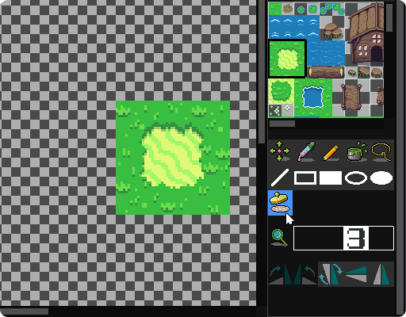
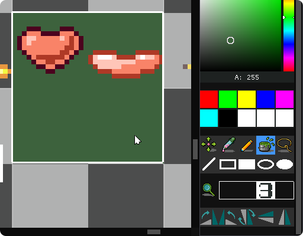
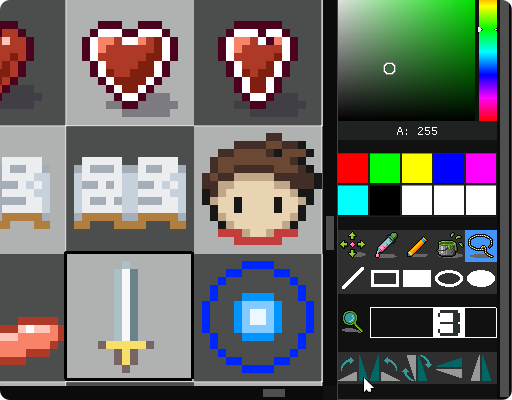

## Operations

[Manual](manual) | **Operations**

### General

* F5/Ctrl+R: run, or continue running
* Shift+F5/Ctrl+.: stop running

* Ctrl+N: new project
* Ctrl+O: open project file
* Ctrl+Shift+O: open project directory
* Ctrl+S: save asset
* Ctrl+Shift+S: save project

* Ctrl+Z: undo
* Ctrl+Y: redo

* Ctrl+C: copy
* Ctrl+X: cut
* Ctrl+V: paste
* Del: delete
* Ctrl+A: select all

* Ctrl+Tab: switch asset
* Ctrl+W: close asset

* Ctrl+Shift+N: add asset
* Ctrl+Shift+A: add file

* F9: toggle breakpoint
* F10: step
* F11: step into
* Shift+F11: step out

* F6: take a screenshot
* F7: start recording frames
* F8: stop recording frames

* F1: open manual

* Use "dir/file", for example, to create assets in directory

### Code Edit

* Tab: indent
* Shift+Tab: unindent

* Ctrl+F: find
* F3: find next
* Shift+F3: find previous
* Ctrl+G: goto line

### Sprite Edit

* CapsLock: toggle grid visibility for ref
* NumLock: toggle transparent background visibility for ref

* +/-: change view scale

* Double click on a frame to change its interval

### Map Edit

* CapsLock: toggle grid visibility for ref
* NumLock: toggle transparent background visibility for ref

* Shift: hold to move
* Alt: hold to pick tile

* Ctrl: hold to replace same colored pixels with the paint bucket tool

* H: move
* I: pick color
* B: pencil
* G: paint bucket
* M: lasso
* L: line
* X: rectangle
* Shift+X: filled rectangle
* E: ellipse
* Shift+E: filled ellipse
* S: stamp

* +/-: change view scale

* [/]: change brush size

* ,: rotate clockwise
* .: rotate anticlockwise
* /: rotate 180 degrees
* ;: vertical flip
* ': horizontal flip

* Use the stamp tool to perform multiple tiles painting

### Image Edit

* CapsLock: toggle grid visibility
* NumLock: toggle transparent background visibility

* Shift: hold to move
* Alt: hold to pick color

* 1/2/3/4/5/6/7/8/9/0: select color

* H: move
* I: pick color
* B: pencil
* G: paint bucket
* M: lasso
* L: line
* X: rectangle
* Shift+X: filled rectangle
* E: ellipse
* Shift+E: filled ellipse

* +/-: change view scale

* [/]: change brush size

* ,: rotate clockwise
* .: rotate anticlockwise
* /: rotate 180 degrees
* ;: vertical flip
* ': horizontal flip

* Select an area then fill with the paint bucket tool to perform a ranged filling

* Rotations with 90 degrees can only be performed on a square area

### Palette Edit

* Home: select the first color
* End: select the last color
* Left/Right/Up/Down: select around

### JSON Edit

* Tab: indent
* Shift+Tab: unindent

* Ctrl+F: find
* F3: find next
* Shift+F3: find previous
* Ctrl+G: goto line

### Text Edit

* Tab: indent
* Shift+Tab: unindent

* Ctrl+F: find
* F3: find next
* Shift+F3: find previous
* Ctrl+G: goto line

### Bytes Preview

For preview only.

### Font Preview

For preview only.

### Sound Preview

For preview only.

* Enter: play
* Esc: stop
